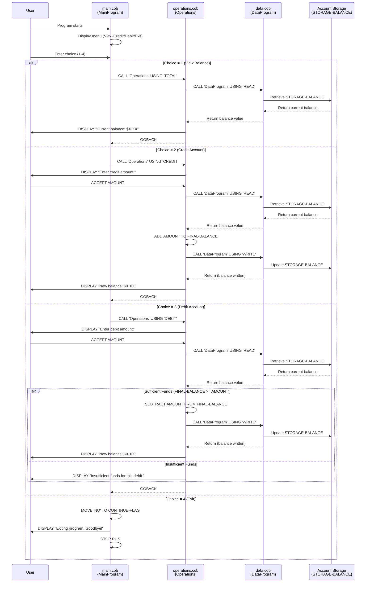

# COBOL Account Management System Documentation

## Overview
This COBOL-based Account Management System provides core functionality for managing student account balances, including viewing balances, crediting accounts, and debiting accounts with proper validation.

---

## COBOL Files

### 1. **main.cob** (MainProgram)
**Purpose**: Entry point and user interface for the account management system.

**Key Functions**:
- Displays a menu-driven interface with four options:
  1. **View Balance** - Calls Operations with 'TOTAL'
  2. **Credit Account** - Calls Operations with 'CREDIT'
  3. **Debit Account** - Calls Operations with 'DEBIT'
  4. **Exit** - Terminates the program
- Continuously loops until user selects to exit
- Validates user input and rejects invalid choices (1-4)

**Working Storage Variables**:
- `USER-CHOICE`: PIC 9 - Stores user's menu selection
- `CONTINUE-FLAG`: PIC X(3) - Controls program loop (YES/NO)

**Business Rules**:
- Program remains active until user explicitly selects "Exit"
- Invalid menu choices prompt user to select 1-4
- Each operation delegates to the Operations program for processing

---

### 2. **data.cob** (DataProgram)
**Purpose**: Manages student account balance storage and retrieval operations.

**Key Functions**:
- **READ Operation**: Retrieves the current balance from storage
- **WRITE Operation**: Persists the balance to storage

**Working Storage Variables**:
- `STORAGE-BALANCE`: PIC 9(6)V99 - Master storage for account balance (initial value: $1000.00)
- `OPERATION-TYPE`: PIC X(6) - Identifies the requested operation

**Linkage Section Variables**:
- `PASSED-OPERATION`: PIC X(6) - Operation type passed from caller
- `BALANCE`: PIC 9(6)V99 - Balance value passed between programs

**Business Rules**:
- Initial account balance is set to $1000.00
- Storage balance persists across operations until explicitly modified
- Supports only READ and WRITE operations
- Returns control to caller upon completion

---

### 3. **operations.cob** (Operations)
**Purpose**: Executes business logic for account transactions and inquiries.

**Key Functions**:

1. **TOTAL (View Balance)**
   - Retrieves current balance from DataProgram
   - Displays balance to user
   - No modifications to account

2. **CREDIT (Add Funds)**
   - Prompts user for credit amount
   - Retrieves current balance
   - Adds the credit amount to balance
   - Persists updated balance to storage
   - Displays new balance to user

3. **DEBIT (Withdraw Funds)**
   - Prompts user for debit amount
   - Retrieves current balance
   - **Validates** that sufficient funds exist (FINAL-BALANCE >= AMOUNT)
   - If valid: Subtracts amount, persists changes, displays new balance
   - If invalid: Displays "Insufficient funds" message and rejects transaction

**Working Storage Variables**:
- `OPERATION-TYPE`: PIC X(6) - Type of operation to perform
- `AMOUNT`: PIC 9(6)V99 - Transaction amount entered by user
- `FINAL-BALANCE`: PIC 9(6)V99 - Current account balance (default: $1000.00)

**Business Rules**:
- All monetary values use packed decimal (V99) for accurate cent precision
- Debit transactions are rejected if balance is insufficient
- Credit and debit operations must call DataProgram to read and write balance
- View balance does not modify account state
- Negative or zero amounts should be handled by user input validation (currently accepts any numeric value)

---

## System Architecture

```
main.cob (MainProgram)
    ↓
    Menu Loop
    ↓
operations.cob (Operations)
    ↓
    Calls → data.cob (DataProgram)
            for READ/WRITE operations
    ↓
    Displays results to user
```

---

## Account Balance Constraints

| Property | Value |
|----------|-------|
| Initial Balance | $1000.00 |
| Data Type | PIC 9(6)V99 (6 digits + 2 decimal places) |
| Maximum Balance | $999,999.99 |
| Minimum Balance | $0.00 |
| Decimal Precision | Cents (.00) |

---

## Transaction Rules

1. **All transactions are validated before execution**
2. **Debit transactions are rejected if insufficient funds**
3. **Credit and debit operations persist to storage immediately**
4. **View balance is a read-only operation**
5. **Account balance cannot go negative**

---

## Future Enhancements

- Input validation for credit/debit amounts (reject negative or zero values)
- Transaction history logging
- Interest calculation for account balances
- Account holder identification
- Transaction limits or daily caps
- Multi-account support

---

## Data Flow Sequence Diagram


